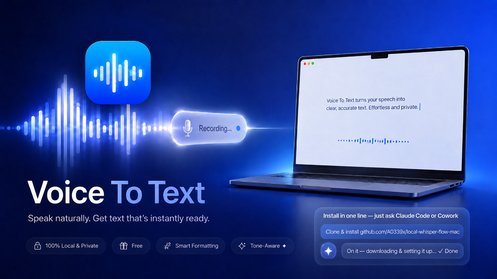

<p align="center">
  
</p>

# Voice-To-Text — a local, free Wispr-Flow clone

Dictation that runs **entirely on your Mac**. No cloud, no subscription, no data
leaving your machine.

## 🪄 Easiest install — just ask Claude

**You don't need to know GitHub or the terminal.** If you have
[**Claude Code**](https://claude.com/claude-code) (the CLI) or **Claude Cowork**
(Anthropic's agent in the Claude desktop app) on your Mac, just give it this one line:

> **Clone and install https://github.com/A0339x/local-whisper-flow-mac and set it up.**

Claude does everything for you — installs the tools, downloads the models, builds
the app, and sets it to start at login. At the very end it'll show you **three
permission switches to flip** in System Settings (the only step a human has to do —
Apple won't let software toggle those). Then tap **Right Option** and start talking.

*Requires an Apple Silicon Mac (M1–M5). Prefer to do it yourself? See [Quick install](#quick-install-apple-silicon-mac) below.*

---

- 🎙️ **Speech-to-text** — OpenAI **Whisper large-v3**, running via Apple's
  **MLX** framework (fast on Apple Silicon — transcribes well under real time).
- 🧠 **Smart formatting** — a local **Ollama** model (`llama3.1:8b`) cleans up the
  transcript: removes filler ("um", "uh"), fixes punctuation, applies spoken
  self-corrections ("…milk, *no wait I mean* oat milk" → "oat milk"), and turns
  enumerations into lists.
- 🌊 **Recording HUD** — a floating waveform pill appears while you talk, with a
  ✕ to cancel and a ✓ to confirm (just like Wispr Flow).
- ⌨️ **Toggle hotkey + auto-paste** — tap a global hotkey to start, tap again to
  stop; the cleaned text is pasted into whatever app you're in.
- 🔊 **Voice-tone aware** — measures each recording's loudness + pitch vs. your
  own adaptive baseline; if you sound excited it adds exclamation marks even when
  the words are neutral, and a mid-sentence pause becomes a paragraph break.
  Tunable via `[tone]` in `config.toml`.
- ✏️ **Command / Write key** (Left Option) — one key, two jobs depending on
  whether you've selected text:
  - **Text selected → edit it.** Speak an instruction ("make this friendlier",
    "turn into bullet points", "fix the grammar", "translate to Spanish") and the
    AI rewrites your selection in place.
  - **Nothing selected → write it for you.** Speak what you want ("draft an email
    to my manager saying I'll be late", "message Jake to reschedule dinner") and
    the AI drafts it and types it at your cursor — styled to the app
    (professional in Gmail, casual in Slack), with no `[placeholders]` to fill in.
  - Runs on **Groq `gpt-oss-120b`** (~0.5 s, sharp drafts) in the main editions —
    one key shared with dictation. A fully-offline mode uses a local model — see
    [Pick your edition](#pick-your-edition-the-installer-asks--no-config-editing).
- 🕘 **Dictation history** — every dictation is saved (`history.jsonl`); open the
  history window (Settings ▸ Dictation History…) and double-click any past
  entry to copy it back to the clipboard.
- 🍎 Menu-bar-only app (🎤 idle · 🔴 recording · ⏳ processing), no Dock icon.

> **Note on "Wispr" vs "Whisper":** *Wispr Flow* (the commercial app) uses a
> proprietary, cloud-only model you cannot download. The open model everyone
> means by "the large model" is **Whisper** (OpenAI) — and that's exactly what
> this uses, locally.

---

## Pick your edition (the installer asks — no config editing)

Run `./setup.sh` and it asks which one you want. Both main editions use **Groq
for the left-Option Write/edit** (`gpt-oss-120b` — OpenAI's open model, much
sharper than a local 8B) and need just **one free Groq key**. They differ by
where **dictation** runs:

| | **Local** (recommended) | **Cloud** |
|---|---|---|
| Dictation | Whisper **on-device** | Groq `whisper-large-v3` |
| Write/edit (left ⌥) | Groq `gpt-oss-120b` | Groq `gpt-oss-120b` |
| Needs | **one** free Groq key | **one** free Groq key |
| Hardware | capable Apple-Silicon Mac | **any** Apple-Silicon Mac (no GPU) |
| Privacy | dictation never leaves the Mac; only Write drafts go to Groq | dictation + Write go to Groq |
| Downloads | Whisper model (~3 GB, once) | none |
| Best for | most people | sharing, low-spec machines |

Both run the **same code** — the edition is just config. The installer collects
the key, writes a gitignored `config.local.toml`, and never commits it. Prefer
OpenAI or another model? It's OpenAI-compatible — one-line swap in the preset.

```bash
./setup.sh            # asks: Local or Cloud
./setup.sh --cloud    # or --local   (non-interactive)
```

<details><summary>Fully offline (no keys, no internet)</summary>

Want zero cloud — dictation **and** Write fully on-device? Run
`./setup.sh --offline`. It installs Ollama and uses **`gpt-oss:20b`** (OpenAI's
open model, the local twin of the cloud one) for the Write/edit side — genuinely
sharp drafts at ~2 s, no keys, works on a plane. Needs a 16 GB+ Mac (the model is
~13 GB); on smaller machines set `model = "qwen2.5:14b"` in `config.toml`. Switch back anytime with `./setup.sh`.
</details>

---

## Quick install (Apple Silicon Mac)

```bash
git clone https://github.com/A0339x/local-whisper-flow-mac.git
cd local-whisper-flow-mac
./setup.sh          # asks: Local or Cloud?
```

`setup.sh` installs `uv` + Ollama, pulls the model, builds the app, and (optionally)
adds it to `/Applications` + login. Requires an **Apple Silicon Mac** (M1–M5) and
~8 GB free for the models.

On first launch a short **setup wizard** walks you through the permissions and
does a quick voice calibration (read a sentence in your normal voice, then an
excited one) so excitement detection is tuned to you. You can re-run it anytime
from the menu (**Setup / Onboarding…**). (See the [ask-Claude install](#-easiest-install--just-ask-claude-code) at the top for the no-terminal path.)

---

## Two ways to run it

### A) As a real Mac app (recommended)

```bash
./build_app.sh
```

This produces **`Voice To Text.app`** in this folder. Double-click it, or drag
it to `/Applications`. It auto-starts Ollama if needed.

**Clicking the app opens the Settings window** (microphone picker + warm-mic
toggle). The first click also starts the background dictation agent; later
clicks just re-open Settings — there's only ever one agent running. The agent
itself is a menu-bar-only background process (no Dock icon).

The app is a thin launcher that runs the code in this folder, so editing
`flow.py` / `config.toml` takes effect on the next launch — no rebuild needed.

### Start automatically at login

The app is registered as a hidden **Login Item**, so macOS launches it at login
the same way clicking it does — which gives the agent the GUI context its
windows need (a launchd-run agent can't show windows). On a cold start it just
starts the background agent silently; it does not pop Settings.

```bash
# turn OFF auto-start at login:
osascript -e 'tell application "System Events" to delete (every login item whose name is "Voice To Text")'

# turn it back ON:
osascript -e 'tell application "System Events" to make login item at end with properties {path:"/Applications/Voice To Text.app", hidden:true}'
```

You can also manage it in **System Settings ▸ General ▸ Login Items**.

### B) From the terminal (for development)

```bash
uv run python flow.py
```

…or double-click `start.command`.

---

## One-time permissions

Dictation needs three macOS permissions. The app inherits them from its own
Python interpreter (`.venv/bin/python`), so when prompted, **allow the process
named "Python"** (or add `Voice To Text.app` manually).

Open **System Settings ▸ Privacy & Security** and make sure the app/Python is
enabled under:

| Permission | Why |
|---|---|
| **Microphone** | to record your voice (you'll get a prompt on first run) |
| **Accessibility** | to detect the global hotkey & to paste (Cmd+V) into apps |
| **Input Monitoring** | so the hotkey works while other apps are focused |

> If you ever ran the old terminal launcher and granted permission to **`uv`**,
> you can safely remove `uv` from Accessibility / Input Monitoring — the app now
> uses its own Python directly.

On the **first dictation**, Whisper large-v3-turbo (~1.5 GB) downloads from
Hugging Face and is cached. Every run after that is instant.

---

## Using it

1. A 🎤 appears in your menu bar.
2. Click into any text field (Notes, Slack, browser, code editor…).
3. Press the hotkey — default **⌃⌥D** (Ctrl+Alt+D). The floating **waveform
   pill** appears (and a *Tink* sound plays). The bars react to your voice.
4. Speak. To finish, **press the hotkey again** or click the **✓** on the pill.
   To throw the recording away, click the **✕** (nothing gets pasted).
5. The text is transcribed, smart-formatted, and **pasted where your cursor
   is**. Icon returns to 🎤.

### Smart formatting examples

| You say | You get |
|---|---|
| "um so i bought apples and then milk no wait i mean oat milk and bread" | "I bought apples, oat milk, and bread." |
| "first sunscreen second the passports and third the chargers" | A numbered list |
| "send it to john period new paragraph thanks" | "Send it to John.\n\nThanks" |

---

## Configuration

Edit **`config.toml`** and relaunch.

- **`[hotkey] combo`** — the trigger. Examples: `"<cmd>+<shift>+<space>"`,
  `"<f9>"`, `"<ctrl>+<alt>+d"`.
- **`[transcription] model`** — any `mlx-community/whisper-*` model.
- **`[transcription] language`** — `"en"` (faster) or `""` to auto-detect.
- **`[formatting]`** — `enabled`, `ollama_url`, and `model` (`llama3.1:8b` for
  speed, `qwen2.5:32b` for smarter corrections).
- **`[paste]`** — `auto_paste` and `restore_clipboard`.
- **`[sounds]`** — start/stop/cancel audio cues.

---

## How it works

```
hotkey ─▶ AudioRecorder (sounddevice, 16 kHz mono) ──▶ live level ─▶ waveform HUD
        └▶ Whisper large-v3-turbo  (mlx_whisper.transcribe)   ── local, GPU/ANE
           └▶ llama3.1:8b           (Ollama /api/chat)         ── local
              └▶ pbcopy + Cmd+V into the focused app
```

The HUD is a non-activating Cocoa `NSPanel`, so clicking ✕/✓ never steals focus
from the app you're pasting into. All in `flow.py` — it's meant to be tweaked.

## Troubleshooting

- **Hotkey does nothing** → grant **Accessibility** + **Input Monitoring** to
  the app's Python, then quit and relaunch the app.
- **"Could not start recording"** → grant **Microphone** access; check the input
  device in System Settings ▸ Sound.
- **Formatting skipped** → make sure Ollama is running (the app starts it for
  you; `ollama serve` to start manually).
- **Pastes into the wrong place** → it pastes wherever the cursor was when you
  stopped; click your target field first.
- **Logs** → see `voice-to-text.log` in this folder.
